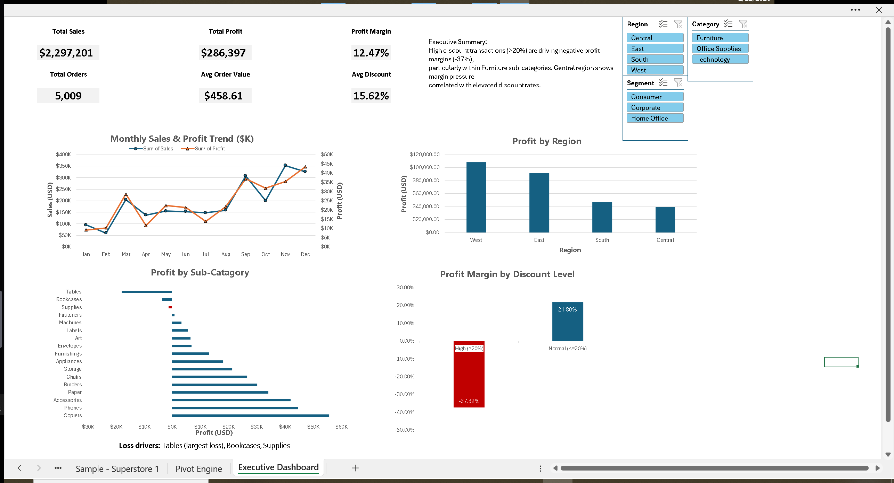

# Retail Operations Performance Dashboard (Excel)

## Overview
Interactive Excel dashboard analyzing retail performance (sales, profit, margin) with a focus on operational drivers like discounting, category/sub-category profitability, and regional performance.

## Business Questions
- What are overall sales, profit, and profit margin?
- How do sales and profit trend over time?
- Which regions and sub-categories drive profit (or losses)?
- How does discounting impact profit margin?

## Tools Used
- Excel (Tables, PivotTables, charts, slicers, calculated fields)

## Key KPIs (from dashboard)
- Total Sales: $2,297,201
- Total Profit: $286,397
- Profit Margin: 12.47%
- Total Orders: 5,009
- Avg Order Value: $458.61
- Avg Discount: 15.62%

## Key Finding (Headline)
Deep discounting is strongly associated with negative profitability:
- High discount (>20%) margin: -37.32%
- Normal discount (<=20%) margin: 21.80%

## Deliverables
- Excel dashboard: `/excel/superstore_dashboard.xlsx`
- Executive memo: `/docs/retail_performance_memo.pdf`
- Screenshots: `/images/`

## Dashboard Preview

